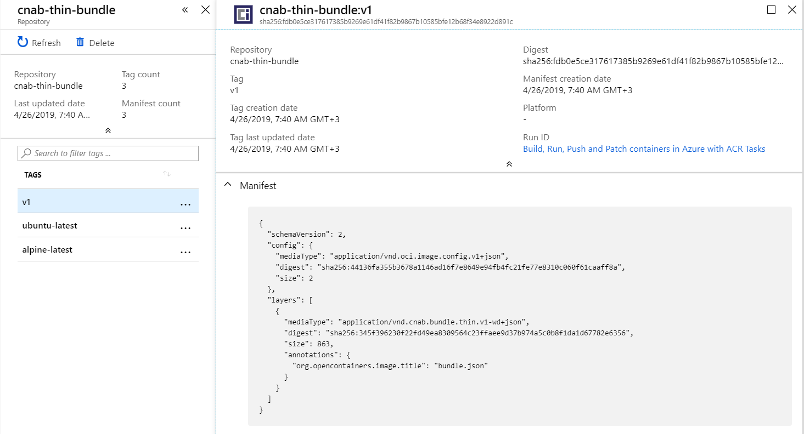

# CORAS
This is an ***experimental*** project for pushing and pulling Cloud Native Application Bundles to OCI registries using [`oras`](https://github.com/deislabs/oras) and [`pivotal/image-relocation`](https://github.com/pivotal/image-relocation).

Do ***NOT*** use it, unless you ***really*** know what you are doing, and are comfortable with breaking changes.

## Building and using:

To build, you need the Go toolchain, `make`, and `dep`:

```
$ make bootstrap
$ make build
```

## How does this work for thin bundles?

- it copies all container images referenced in the bundle into the new repository, using the [`pivotal/image-relocation`](https://github.com/pivotal/image-relocation) library --  with one difference -- **it pushes all container images under the same repository**. (There is also a human-readable tag created, under the `<original-image-name>-<new-tag>` format, but this is not intended to be further used).
- it updates the bundle with the new image location, populating the `originalImage` and digest fields appropriately. (Currently, this library relies in `pivotal/image-relocation` entirely for the new digest, and doesn't really check that the digest hasn't changed. We **must** check the digest in the future).
- it pushes the newly updated bundle **to the same repository**, using [`deislabs/oras`](https://github.com/deislabs/oras).

Example:

```
radu:coras$ ./bin/coras push testdata/test.json cnabregistry.azurecr.io/cnab-thin-bundle:v1
2019/04/26 07:40:21 pushed blob: sha256:cdf98d1859c1beb33ec70507249d34bacf888d59c24df3204057f9a6c758dddb
2019/04/26 07:40:22 pushed blob: sha256:bdf0201b3a056acc4d6062cc88cd8a4ad5979983bfb640f15a145e09ed985f92
2019/04/26 07:40:22 cnabregistry.azurecr.io/cnab-thin-bundle:alpine-latest: digest: sha256:5c40b3c27b9f13c873fefb2139765c56ce97fd50230f1f2d5c91e55dec171907 size: 528
2019/04/26 07:40:24 pushed blob: sha256:94e814e2efa8845d95b2112d54497fbad173e45121ce9255b93401392f538499
2019/04/26 07:40:24 pushed blob: sha256:63366dfa0a5076458e37ebae948bc7823bab256ca27e09ab94d298e37df4c2a3
2019/04/26 07:40:24 pushed blob: sha256:041d4cd74a929bc4b66ee955ab5b229de098fa389d1a1fb9565e536d8878e15f
2019/04/26 07:40:25 pushed blob: sha256:6e1bee0f8701f0ae53a5129dc82115967ae36faa30d7701b195dfc6ec317a51d
2019/04/26 07:40:31 pushed blob: sha256:898c46f3b1a1f39827ed135f020c32e2038c87ae0690a8fe73d94e5df9e6a2d6
2019/04/26 07:40:31 cnabregistry.azurecr.io/cnab-thin-bundle:ubuntu-latest: digest: sha256:f2557f94cac1cc4509d0483cb6e302da841ecd6f82eb2e91dc7ba6cfd0c580ab size: 1150
WARN[0013] encountered unknown type application/vnd.cnab.bundle.thin.v1-wd+json; children may not be fetched
WARN[0013] reference for unknown type: application/vnd.cnab.bundle.thin.v1-wd+json  digest="sha256:345f396230f22fd49ea8309564c23ffaee9d37b974a5c0b8f1da1d67782e6356" mediatype=application/vnd.cnab.bundle.thin.v1-wd+json size=863

radu:coras$ ./bin/coras pull thisisathinbundle.json cnabregistry.azurecr.io/cnab-thin-bundle:v1
WARN[0000] reference for unknown type: application/vnd.cnab.bundle.thin.v1-wd+json  digest="sha256:345f396230f22fd49ea8309564c23ffaee9d37b974a5c0b8f1da1d67782e6356" mediatype=application/vnd.cnab.bundle.thin.v1-wd+json size=863
WARN[0000] unknown type: application/vnd.oci.image.config.v1+json
WARN[0000] encountered unknown type application/vnd.cnab.bundle.thin.v1-wd+json; children may not be fetched
radu:coras$ ls -al thisisathinbundle.json
-rwxrwxrwx 1 radu radu 863 Apr 26 07:41 thisisathinbundle.json

radu:coras$ cat thisisathinbundle.json
{"name":"helloworld-testdata","version":"0.1.2","description":"An example 'thin' helloworld Cloud-Native Application Bundle","maintainers":[{"name":"Matt Butcher","email":"matt.butcher@microsoft.com","url":"https://example.com"}],"invocationImages":[{"imageType":"","image":"cnabregistry.azurecr.io/cnab-thin-bundle:alpine-latest","originalImage":"alpine:latest","digest":"sha256:5c40b3c27b9f13c873fefb2139765c56ce97fd50230f1f2d5c91e55dec171907"}],"images":{"my-microservice":{"imageType":"","image":"cnabregistry.azurecr.io/cnab-thin-bundle:ubuntu-latest","originalImage":"ubuntu:latest","digest":"sha256:f2557f94cac1cc4509d0483cb6e302da841ecd6f82eb2e91dc7ba6cfd0c580ab","description":"my microservice"}},"parameters":{"backend_port":{"type":"integer","destination":{"env":"BACKEND_PORT"}}},"credentials":{"hostkey":{"path":"/etc/hostkey.txt","env":"HOST_KEY"}}}
```


## FAQ for thin bundles

- how does this look in the registry? 

There is one tag created for the bundle (in this example, `:v1`, and one tag for each image referenced in the bundle - although those images should be refernced by their SHA)



- can I directly `docker pull` referenced images?

Yes (notice that the here, we are using the repository where we pushed the bundle, but we are passing the SHA of the `ubuntu` image -- see the pulled bundle for details):

```
radu:coras$ docker pull cnabregistry.azurecr.io/cnab-thin-bundle@sha256:f2557f94cac1cc4509d0483cb6e302da841ecd6f82eb2e91dc7ba6cfd0c580ab
sha256:f2557f94cac1cc4509d0483cb6e302da841ecd6f82eb2e91dc7ba6cfd0c580ab: Pulling from cnab-thin-bundle
Digest: sha256:f2557f94cac1cc4509d0483cb6e302da841ecd6f82eb2e91dc7ba6cfd0c580ab
Status: Downloaded newer image for cnabregistry.azurecr.io/cnab-thin-bundle@sha256:f2557f94cac1cc4509d0483cb6e302da841ecd6f82eb2e91dc7ba6cfd0c580ab
```

Notes on thin bundles, relocating images, and media types used:

- currently, the library doesn't handle images referenced by their SHA in the input bundle -- but since it uses [`pivotal/image-relocation`](https://github.com/pivotal/image-relocation) for relocating images (which supports all ways of referencing images), so will this library.
- the media type of the manifest pushed to the reigstry -- by default, `oras` pushes files using `"mediaType": "application/vnd.oci.image.config.v1+json"`, which is an OCI image configuration. We are currently testing how use an [OCI image index](https://github.com/opencontainers/image-spec/blob/master/image-index.md) (similar to how [`cnab-to-oci`](https://github.com/docker/cnab-to-oci) uses a Docker manifest list to reference images used in the bundle). See [this issue for more context](https://github.com/radu-matei/coras/issues/8), and [this fork of `oras`](https://github.com/radu-matei/oras/tree/push-oci-index) for an example of how to do this.


## How does this work for thick bundles?

- using an exported (thick) bundle, it will be pushed to the registry as a single layer, the `.tgz` file itself:

```
radu:coras$ duffle export testdata/test.json --bundle-is-file
radu:coras$ ls -al helloworld-testdata-0.1.2.tgz
-rwxrwxrwx 1 radu radu 35223176 Apr 26 07:11 helloworld-testdata-0.1.2.tgz

radu:coras$ ./bin/coras push helloworld-testdata-0.1.2.tgz cnabregistry.azurecr.io/cnab-thick:latest --exported
WARN[0000] encountered unknown type application/vnd.cnab.bundle.thick.v1-wd+json; children may not be fetched
WARN[0000] reference for unknown type: application/vnd.cnab.bundle.thick.v1-wd+json  digest="sha256:b3a8ab2f87aa4b57933b6e531853368ba26af458a943aa3a1f92b72954b52eb5" mediatype=application/vnd.cnab.bundle.thick.v1-wd+json size=35223176

radu:coras$ ./bin/coras pull thisisathickbundle.tgz cnabregistry.azurecr.io/cnab-thick:latest --exported
WARN[0000] reference for unknown type: application/vnd.cnab.bundle.thick.v1-wd+json  digest="sha256:b3a8ab2f87aa4b57933b6e531853368ba26af458a943aa3a1f92b72954b52eb5" mediatype=application/vnd.cnab.bundle.thick.v1-wd+json size=35223176
WARN[0000] unknown type: application/vnd.oci.image.config.v1+json
WARN[0005] encountered unknown type application/vnd.cnab.bundle.thick.v1-wd+json; children may not be fetched
pulled digest: sha256:e7a4d587956ba714f1da820926fb336d722857e164401087dbf323eb5f995bcd  layers: [{application/vnd.cnab.bundle.thick.v1-wd+json sha256:b3a8ab2f87aa4b57933b6e531853368ba26af458a943aa3a1f92b72954b52eb5 35223176 [] map[org.opencontainers.image.title:bundle.tgz] <nil>}]

radu:coras$ ls -al thisisathickbundle.tgz
-rwxrwxrwx 1 radu radu 35223176 Apr 26 07:12 thisisathickbundle.tgz

radu:coras$ duffle import thisisathickbundle.tgz
radu:coras$ ls -al thisisathickbundle
total 4
drwxrwxrwx 1 radu radu 4096 Apr 26 07:13 .
drwxrwxrwx 1 radu radu 4096 Apr 26 07:13 ..
drwxrwxrwx 1 radu radu 4096 Apr 26 07:11 artifacts
-rwxrwxrwx 1 radu radu 1338 Apr 26 07:10 bundle.json
```

